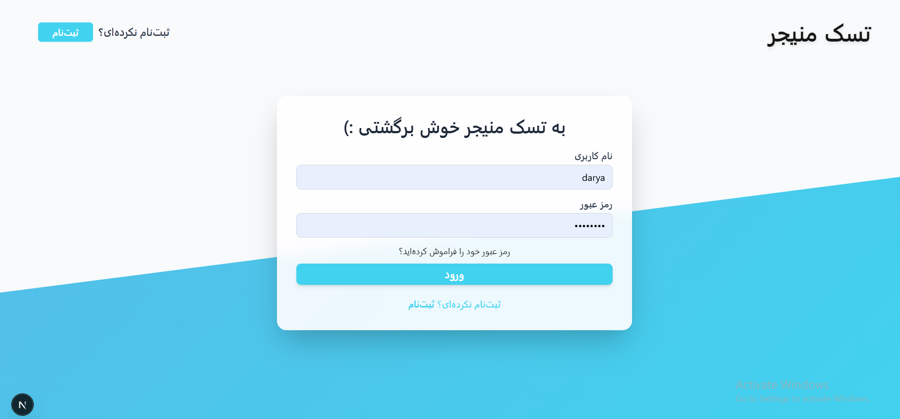
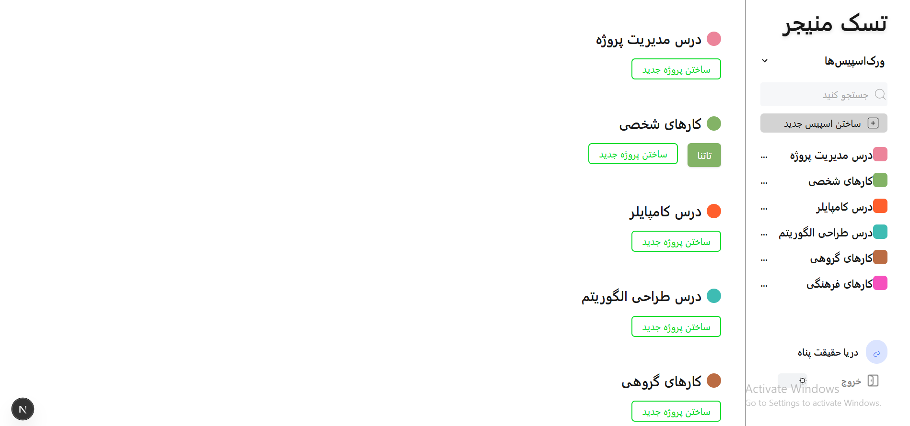
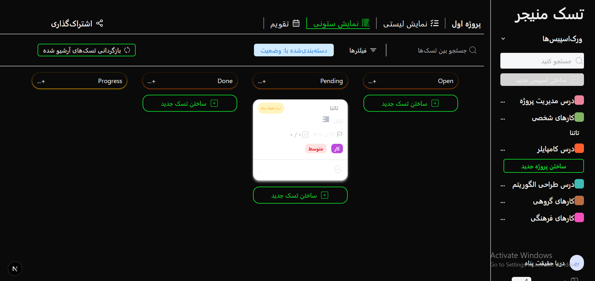

# 🗂️ Task Manager

A modern and responsive Task Management application built with **Next.js**, **React**, **TypeScript**, **Redux Toolkit**, and **Tailwind CSS**.

This portfolio project demonstrates modern frontend development practices, including user authentication, workspace management, theme customization, scalable architecture, reusable components, and state management.

---

## ✨ Features

- 🔐 User Authentication (Login & Sign Up)
- ✅ Form validation with Formik & Yup
- 👤 User Profile Management
- 🗂️ Workspace Management
- 📝 Create, Edit, and Delete Tasks
- 📋 List View & Board View
- 🌙 Dark & Light Theme Switching
- 🪟 Interactive Modals
- 📱 Fully Responsive Design
- ⚡ Global State Management with Redux Toolkit
- 🧩 Reusable Components using Atomic Design
- 💾 Data Persistence with Local Storage

---

## 📸 Screenshots

### Login



### Workspace



### Board View


### List View


### Add Project / Task


### Profile & User Information


### Theme Settings


### Dark Mode



---

## 🛠️ Tech Stack

- Next.js
- React
- TypeScript
- Redux Toolkit
- Formik
- Yup
- Tailwind CSS
- Git
- GitHub

---

## 🏗️ Architecture

The project follows the **Atomic Design** methodology to create reusable, scalable, and maintainable UI components.

```
components/
├── atoms/
├── molecules/
├── organisms/
└── templates/
```

---

## 📦 Data Storage

This project is a frontend-focused portfolio application.

User authentication, profile information, workspaces, and tasks are managed and stored using **Local Storage**. No backend or external API is used in this version.

---

## 🎯 Project Goal

The goal of this project was to practice building a real-world frontend application using modern React technologies, scalable architecture, reusable components, and clean state management.

---

## 🚀 Getting Started

Clone the repository and install dependencies:

```bash
npm install
```

Run the development server:

```bash
npm run dev
```

Open your browser and visit:

```
http://localhost:3000
```

---

## 📌 Project Status

✅ Completed — Portfolio Project

---

## 👩‍💻 Author

Developed by **Darya**
